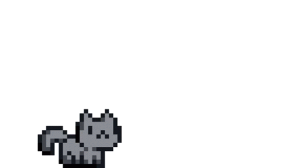

<h1 align="center">Hi 👋🏻, I'm Shahad Basem</h1>
<h3 align="center">Junior Software Engineering Student</h3>

  

### ✨ | About Me
Software Engineering student @Umm Al-Qura University with an interest in:
- building real-world solutions through software design and development.  
- applying software engineering principles through coursework and personal projects.
- exposure to system architecture concepts, cloud-based environments, and agile-oriented development.  
I value collaboration, adaptability, and continuous learning, and I enjoy growing my skills by working on practical and meaningful applications 

  
<b>More info ⬇️</b>

## 🎯 | My Projects

<table>
<tr>
<td width="65%">

### 🏥 HealthBuddy (Graduation Project)
A health-focused mobile application designed to help users track and improve their daily lifestyle.  
The app aims to promote healthier habits through intuitive UI, personalized features, and accessible health insights.  

Currently under development as part of our senior graduation project.

</td>
<td width="35%" align="center">

</td>
</tr>
</table>

## 🛠 Languages & Tools

### 🎨 Frontend

  
  
  
  

### ⚙️ Backend

  
  
  

### 🧰 Tools & Design

  
  

## 🌐 Where to find me

  <strong>Email: shahad.engineer1@gmail.com</strong>

  
  
  

